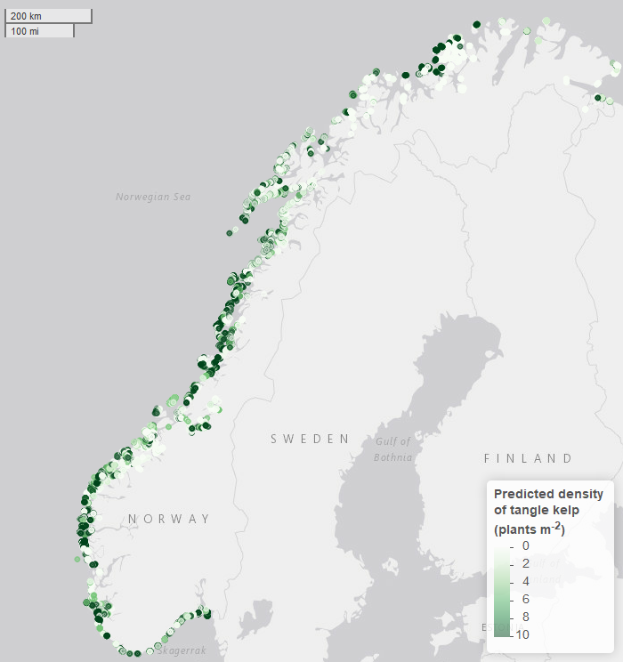
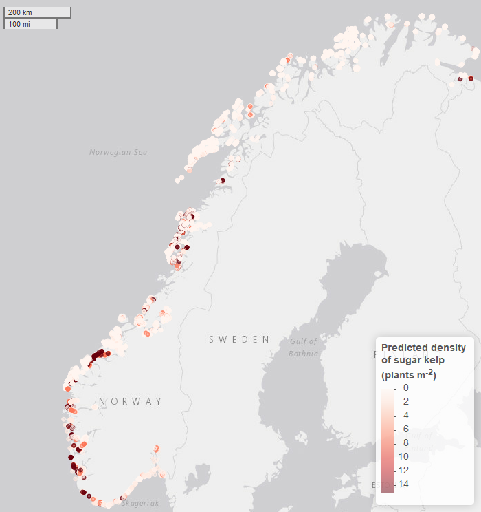
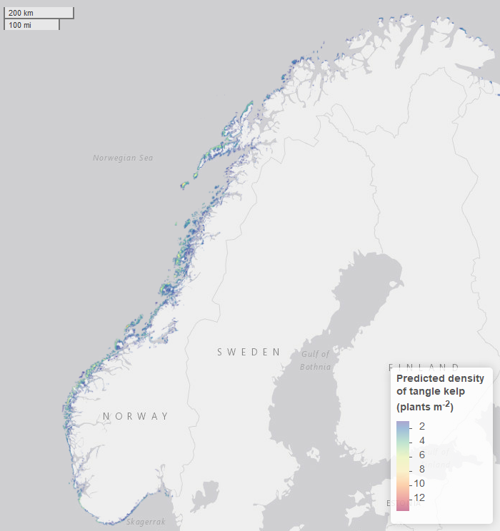

```{r setup, include=FALSE}
knitr::opts_chunk$set(echo = TRUE)
require(tidyverse)
require(flextable)
```

# Journal
Hva med Ecography? 
Diskuterte også med HGU å dele opp i to artikler. 1) Artikkel der vi publiserer modellen fra blått karbon-prosjektet, og 2) artikkel der vi har forenklet modell og viser fortid- og framtidsprediksjoner. Det er nr 1 vi har skrevet outline til her:

# Outline

Try to keep it short and simple. Avoid all the standard stuff about kelp and the importance of kelp forests. Should go without explicit saying when describing the Blue Carbon project aims etc. (The people seeking this information probably knows all that stuff anyways ...)

## Introduction

* Nordic Blue Carbon Project - background, aim, prospects?
* Knowledge sought by Norwegian and Nordic authorities 
* The SDM models - uses and output
* The kelp models
  - Unique in spatial coverage and resolution
  - Potential uses

## Mat & Met - translate from report and use some text from Nordic paper

* Observation data: Description of data, maps of observation points 
* Environmental data: Table with variable, source and summary stats (range, mean, etc ...)
* Brief discussion of attempt of including urchin grazing pressure 
* Modeling: BRT fitting

## Results + Disc

* Validation
* Some key numbers and discussions of their validity. See Gundersen et al 2022 to avoid conflicts and/or duplicate publ
* Strengths and weaknesses
* Future prospects - "teaser"


# AUTHORS: 
**Guri Sogn Andersen**, Kristina Kvile, ...., Helene Frigstad, Hege Gundersen

# INTRODUCTION

Kelp forests play an important role in the Norwegian carbon cycle, and has been shown likely to sequester a significant amount of carbon each year (Gundersen et al., 2011). Publications with global perspectives on the important role of kelp in the marine carbon cycle .... (Krause-Jensen &
Duarte, 2016), recently sparked interest among Nordic environmental authorities. This served as a backdrop for an initiative from the Nordic Council of Ministers, seeking to update and increase the knowledge base for the Nordic marine carbon cycle in order to include blue forests in the national carbon inventories. This initiative birthed The Nordic Blue Carbon Project, which aimed to create an updated, quantitative overview of the carbon cycles of kelp, eelgrass and rockweed in the Nordic region and address the knowledge gaps in long-term carbon storage of macrovegetation in Nordic waters. A fundamental part of this project was therefore to establish species distribution models (SDMs) of the most important forest systems. *Kelp forests is by far the most abundant ... blabla ? *, and the main results were SDMs of two kelp forest systems on both the Nordic and Norwegian level. The Nordic models were recently published (Kvile et al., 2022), and show the spatial distribution of sugar and tangle kelp forests (presence/absence) in the Nordic region. The Norwegian data set, mainly stems from the national mapping of tangle kelp in the Norwegian Program for Mapping Biodiversity (Bekkby et al., 2013). The data set includes accurately geo-referenced information on kelp density at a relatively high spatial resolution (**see map**), and this level of detail facilitated a much more detailed modelling approach. To analyze and predict the distribution of kelp based on a large number of potentially interacting environmental variables, we used boosted regression trees (BRT), a method that combines the advantages of machine learning and statistical regression techniques (Elith et al., 2008). The here presented models show the spatial variation in plant density within the two most important forest forming kelp species, namely *Saccharina latissima* (sugar kelp) and *Laminaria hyperborea* (tangle kelp), along the Norwegian mainland. The prediction maps cover the entire coastline of Norway at a 25 m spatial resolution. These maps are therefore uniquely detailed, to a level that is to our knowledge unprecedented in marine mapping.

**Skal vi ha med konvertering til biomasse?**

# MATERIALS AND METHODS

## Datasets

### Kelp registrations

The data were sampled through the Norwegian Program for Mapping Biodiversity (Bekkby et al., 2013). The program was designed for tangle kelp primarily (n = 11 891 observations), but sugar kelp was also registered when found (n = 11 053). The data set is thus well suited for modelling tangle kelp, but less so in the case of sugar kelp. Data was registered using an underwater video camera with an approximate observation window of 5 square meters??? (**Se kartleggingsprogram**). Density categories are quantified as absence, single plants, scarce, moderately dense, and dense forest, representing density categories of 0, 0.1, 0.5, 5 and 10 individual kelp plants per m2 for tangle kelp and 0, 0.5, 1, 7 and 15 for sugar kelp (ref Bekkby?). 

*Print maps, remember contributions in caption (Leaflet option turned off)*





### Environmental data / GIS models

In fitting the models for Norway, we used field-measured depth and a range of environmental variables extracted from both national and global spatial datasets. 
 
Wave exposure was extracted from a model with a 25 m spatial resolution (Isæus, 2004) based on fetch, wind speed and wind frequency. Ocean current speed (m/s) was modeled at a horizontal resolution of 800 m (NorKyst-800; Albretsen et al., 2011) using the three-dimensional numerical ocean model ROMS (Shchepetkin & McWilliams, 2005; Haidvogel et al., 2008) and downscaled to 25 m resolution. The 90th percentiles for seabed currents were used in our analyses. Due to the lack of a full cover, high resolution substrate model, which does not exist for Norway, slope (°) and terrain curvature (m) were derived from a bathymetry model with a 25 m horizontal resolution, provided by the Norwegian Hydrographic Service. Terrain curvature was estimated with a 250, 500 and 1 000 m spatial calculation window (Bekkby et al., 2009). Slope and curvature were included as proxies for substrate under the assumption that gentle slopes and depressions are areas of higher likelihood of sedimentation and thus not hard substrate. Light at the seabed (photosynthetically active radiation, PAR) has been modeled using data from ocean color satellite sensor estimates (Saulquin et al., 2013, Populus et al., 2017) at a resolution of 100 m, and was downscaled to a model with 25 m resolution. All predictor variables given above, including the 25 m bathymetry model, were available as full cover GIS layers and used for making predictive distribution maps for kelp. We also included variables from the global Bio-ORACLE datasets on nutrients, dissolved oxygen, temperature and salinity at mean, maximum and minimum depths (within grid cells of 5 arc xxx minutes resolution, which corresponds to slightly less than 10 km at the equator). Historic monthly data on seabed temperature and salinity at a grid resolution of 0.25° (**check**) was gathered from the Copernicus Marine Service, and annual mean and max temperatures at each observation point was calculated and used in fitting the model (**Check script or ask Kristina**), while full-coverage Bio-ORACLE layers were used in the map predictions of the present state of the density distributions. **Something about how we coupled historic data in the fitting process (from copernicus). Buffers etc ... We need perhaps to justify the choice of min/mean or max depth in the BO-layers. For the meantemp, the mindepth was used, while for the maxtemp the mean depth was used. This was mainly based on the first version of the model, but needs perhaps to be explained in some other way to simplify?** Even though the resolution is relatively low, we chose to use Bio-ORACLE for temperature and salinity data in the hope of utilizing their future climate projection layers for these variables (corresponding to predictions for the different RCP scenarios). It will eventually be possible to plug these predictions into the model to make scenarios for future kelp distribution, plant densities and biomass along the Norwegian coast. **Compare resolution of Copernicusdata with Bio-ORACLE. If we must justify the use of Bio-ORACLE in predictions, maybe better to say something about coverage (which is far better with BO).**

We coupled kelp observations (*Figure X*) to environmental data by extracting values from environmental raster layers cells in which the kelp observations were located. If a kelp observation was outside the cover of a raster layer, or data was missing in that specific cell, the environmental variable was set to missing (NA).

```{r obs environmetal space, echo = FALSE}
read.csv2("../Tables/EnvTable.csv") %>% flextable %>%
    add_header_row(
    top = TRUE,                # New header goes on top of existing header row
    values = c("Variable",     # Header values for each column below
               "Tangle kelp",   
               "",             # Leave blank, as it will be merged
               "",
               "Sugar kelp",         
               "",             # Leave blank, as it will be merged 
               "")) %>% 
    
  set_header_labels(         # Rename the columns in original header row
      name = "",
      Min_tangle = "min",
      Mean_tangle = "mean",
      Max_tangle = "max",
      Min_sugar = "min",
      Mean_sugar = "mean",
      Max_sugar = "max")  %>%
  
  merge_at(i = 1, j = 2:4, part = "header") %>% # Horizontally merge columns 2 to 4 in new header row
  merge_at(i = 1, j = 5:7, part = "header") %>% # Horizontally merge columns 5 to 7 in new header row
  flextable::align(align = "center", j = c(2:7), part = "all") %>% 
  # add vertical lines 
  vline(part = "all", j = 1) %>%   # at column 2 
  vline(part = "all", j = 4) %>%   # at column 5
  # merge cells
  merge_at(i = 1:2, j = 1, part = "header") %>% 
  # font changes
  bold(i = 1, bold = TRUE, part = "header") %>% 
  italic(i = 2, italic = TRUE, part = "header") %>% 
  fontsize(i = 1:11, size = 8, part = "body") %>% 
  fontsize(i = 1:2, size = 10, part = "header") %>% 
  autofit()
```


## Model framework

To predict the spatial distribution of kelp, boosted regression tree (BRT) models were built using the gbm (Greenwell et al., 2020) and dismo (Hijmans et al., 2020) libraries in R (R Core Team, 2020). When using this approach, many simple models (“trees”) are built and combined (“boosted”) for prediction (Elith et al., 2008). The BRT models have several advantages, for example, a large number of predictor variables of different types can be implemented without prior data transformation; potential complex interactions between variables are automatically handled; models are insensitive to outliers; and missing values are accommodated (Elith et al., 2008). Moreover, BRTs can handle sharp discontinuities, which is critical in cases such as ours, where the species’ distribution is small relative to the covered area.

Boosted Regression Tree models were built for Laminaria and Saccharina separately, with kelp plant density as response variable. The response was transformed (log + 1), wich supported the assumption of a gaussian error distribution. We kept most model parameters to their defaults (Hijmans et al., 2020) but used an optimization routine based on cross-validated deviance to determine the optimal combination of three important parameters: learning rate (testing 0.0001, 0.001 and 0.01), tree complexity (testing 2, 4 and 6), and bag fraction (testing 0.5, 0.6 and 0.7) (Smith, 2021). Learning rate sets the weight given to each tree, and smaller learning rate is preferable but computationally costly as a higher number of trees is required. Tree complexity defines the complexity of interactions that can be fitted, if required by the data. Bag fraction is the fraction of the data used in selecting variables at each iteration (each tree), which makes the model stochastic and has been shown to improve predictive power (Elith et al., 2008). The optimal parameter combinations were learning rate 0.01, tree complexity 6 and bag fraction 0.6 (7700 trees) for Laminaria, and learning rate 0.01, tree complexity 6 and bag fraction 0.7 (7000 trees) for Saccharina. After identifying the optimal models with all explanatory variables included, we ran a simplification procedure to remove variables that contributed little to the two models predictive power using k-fold cross validation (Elith et al., 2008).

## Final model

Based on the final BRT models with unimportant predictor variables removed, we predicted the density of kelp along the Norwegian coast using the ‘predict’ function in the raster package in R (Hijmans, 2022). **Noe om konvertering til biomasse??**

We created a uniform raster object of all environmental predictor variables included in the models, resampling all GIS-layers to a 25 m resolution covering the whole model area (the Norwegian coast). While measured depth from the kelp registration was used in the model fitting, we used the full cover bathymetric data (m) for the predictions. And while historic temperature data was used in the fitting process, a static representation of present day annual mean and maximum temperature based on long term averages (Bio-Oracle) was used for the spatial predictions (**sjekk spesifisering av variabel**). Predictions from BRT models are given for all cells regardless of the presence of missing values for some variables, and missing values are set to the overall mean value for that variable. 


# Results
## Predicted Kelp Distribution
* **In words**
* **Show maps**

Tangle kelp presence is predicted along almost the entire coastline of Norway, with the highest densities and largest continuous areas in Mid-Norway. Areas with plant densities above 5 individuals m^-2^ are considered kelp forests. There are, however vast areas with predicted tangle kelp presence, where densities falls below this "threshold". 
<!-- May explain differences between forest areas predicted from previous models (especially the rule based models) and the here presented version -->
<!-- Discuss briefly urchin grazing -->




```{r national kelp numbers, echo = FALSE}
read.csv("../Tables/lamhyp_rastertable.csv") %>% 
  add_column(Kelp = NA, .before = "densities") %>% 
  mutate(Kelp = "Tangle kelp") %>% 
  flextable %>%
    add_header_row(
    top = TRUE,                # New header goes on top of existing header row
    values = c("Kelp",     # Header values for each column below
               "Densities",   
               "N",             # Leave blank, as it will be merged
               "Area",
               "")) %>% 
    
  set_header_labels(         # Rename the columns in original header row
      Kelp = "",
      densities = "",
      N = "",
      Area_km = "km", 
      Biomass_milltonn = "mill tonn")  %>%
  
  compose(part = "header", i = 2, j = 4,
         value = as_paragraph("km", as_sup("2"))) %>% 
  
  merge_at(i = 1, j = 4:5, part = "header") %>% # Horizontally merge columns 
  merge_at(i = 1:2, j = 1, part = "header") %>% 
  merge_at(i = 1:2, j = 2, part = "header") %>% 
  merge_at(i = 1:2, j = 3, part = "header") %>% 
  flextable::align(align = "center", j = c(2:5), part = "all") %>% 
  # add vertical lines 
  vline(part = "all", j = 1) %>%   # at column 2 
  vline(part = "all", j = 3) %>%   # at column 5
  # font changes
  bold(i = 1, bold = TRUE, part = "header") %>% 
  italic(i = 2, italic = TRUE, part = "header") %>%  
  fontsize(i = 1:2, size = 10, part = "header") %>% 
  fontsize(i = 1:2, size = 8, part = "body") %>%
  autofit()
```


## Associations with Environmental Variables
The tangle kelp model performed reasonably well, with a total deviance explained as close to 75% (a measure of variation in the data explained by the model) and correlation values between data and model predictions at 0.87 (based on training data) and 0.79 (based on cross-validation, CV). The sugar kelp model performed less well. Although the total deviance explained was approximately the same, the correlation values were lower (0.84 and 0.66 for training data and CV, respectively). The larger gap in correlation values between data and model predictions when comparing training data and CV, means that there is an increased risk of prediction errors. Hence, our confidence in model predictions is stronger with the tangle kelp than the sugar kelp model, particularly when the models are used for geographic extrapolation or future projections. 

Ten explanatory variables were kept in the final BRT model for tangle kelp, with the most important being depth, wave exposure, nitrate concentration and curvature of the sea bottom (**see Figure**). The results place the optimum of tangle kelp in an environmental space where depth is shallower than 30 m, exposure to wave action is considerable (**some sort of units?**), the nitrate and phosphate concentrations are relatively low (**be more specific with regards to units and season/mean/...**), the terrain is hilly, preferably convex (within a 500 m2 window). In addition, predicted densities will generally be higher in ... **how do we interpret the oxygen levels? (plot these in a map to see)**, the annual mean temperature is above 8&deg;C and the annual maximum temperature is below 15&deg;C, **don't understand the relationship with current** and the maximum salinity above 34 psu.

In the final BRT model for sugar kelp eleven variables were kept, with the most important being depth, wave exposure, mean temperature, and dissolved oxygen (**see Figure**). In comparison with tangle kelp, the vertical distribution of sugar kelp seems narrower with a clear limiting driver acting in the shallow areas. The optimum is shifted more towards the sheltered parts of the environmental space, but with seemingly similar requirements with regards to annual mean temperature (above 8&deg;C) and a similar preference for hilly terrain (convex terrain with slope 40-55&deg). Along gradients of dissolved oxygen, however the density optimas varies considerably and are almost opposite (**and is not easy to interpret?? what does this mean?? effect of competition?**). A similar pattern of opposite relationships can perhaps be discerned along a gradient of maximum salinity (dip around 35 psu). A notable difference is also the suggested optimum of higher annual maximum temperatures (15-20&deg;C).  

*Add marginal effect plots here*
*Perhaps also interaction plots?*
<!-- Make table with info on variables instead of having it in the figure text? -->

![Partial relationships between densities of tangle kelp (*Laminaria hyperborea*) and sugar kelp (*Saccharina latissima*) plants and the environmental variables kept in the final models, sorted according to degree of influence. The plots show the effect of a variable after accounting for the average effects of all other variables in the model. Coloured lines show the marginal effect of the variable and solid thick black lines give a smooth representation of the response. Numbers in brackets provide the relative contribution of the given variable. The coloured rug on the x-axis shows the location of training data.](../Figures/MarginalEffectsStudioSave.png)

# Discussion

**Skryt her:**
We here present uniquely detailed density distribution maps of the two most important forest forming kelp species in Norway, namely sugar kelp (*Saccharina latissima*) and tangle kelp (*Laminaria hyperborea*). 

**Problemer her:**
The underlying kelp data predominantly stem from surveys conducted to document the distribution of tangle kelp, and data from typical sugar kelp areas are therefore underrepresented. This may have lead to observations of sugar kelp being biased towards low density registrations, which may contribute to an underestimation of sugar kelp densities, but not necessarily of the total distribution area.

**Sett i fht. annen litteratur etc.:**

**Nytteverdi etc.:**

**From report:**
When including all areas with densities ≥1 plant per m2, we estimated the total area
covered by tangle kelp to be 18 155 km2, and 44 300 km2 for sugar kelp. However,
when including only high-density areas, by setting cut-off values for forest at ≥5 for
tangle kelp and ≥7 for sugar kelp, these numbers were reduced to 3 810 km2 and 3
607 km2. These numbers are slightly lower for tangle kelp and higher for sugar kelp
compared to former estimates by Gundersen et al. (2011), who estimated 5 900 km2
and 2 000 km2 for tangle kelp and sugar kelp, respectively, using a rule-based GIS
model. It should also be taken into consideration that, since Gundersen et al. (2011)
made these estimates, there has been a significant regrowth of kelp (mostly sugar
kelp) following sea urchin destruction.
The new kelp distribution models provided very detailed maps of densities, which
varied greatly depending on environmental factors (Figure 2 and Figure 3). Insight
into this spatial variation showed that there are vast areas with low densities of kelp
forest along the Norwegian coast, compared to the high-density forests (Figure 4).
The primary production is calculated and presented in Chapter 3.